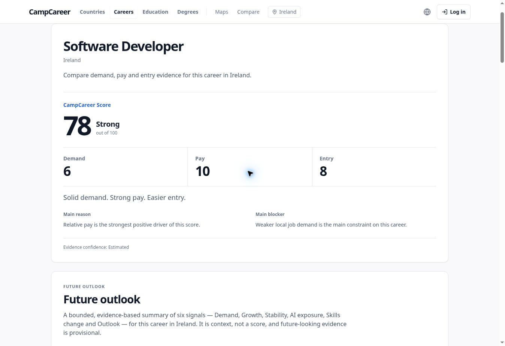
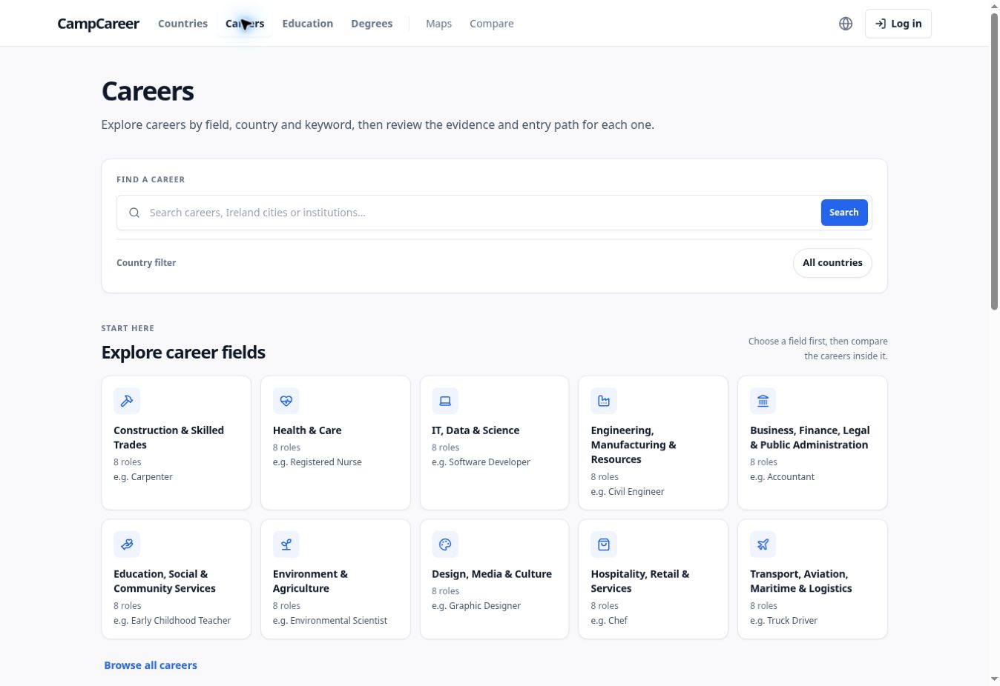
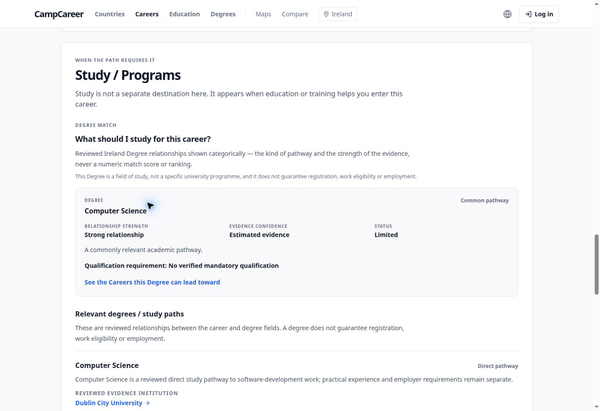
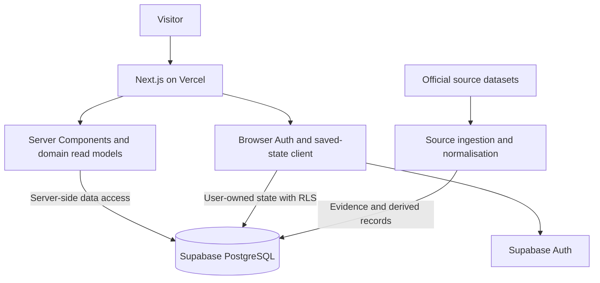
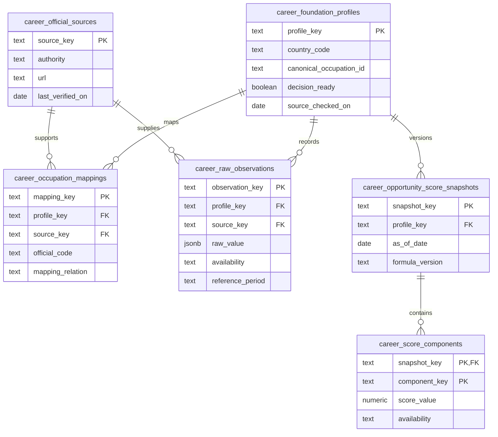

# CampCareer

**Know if a career is worth pursuing. See the evidence and the path to get there.**

CampCareer is a career-decision web application connecting labour-market evidence, entry requirements, degree pathways and employment context. It helps someone considering a new career answer: **Is this career worth it in this country, and what should I do next?**

Created by [Yaehun Lee](https://github.com/leeyaehun) as an ongoing product and software-engineering portfolio project.

**[Live Demo](https://www.campcareer.com/)** · **[Ireland: Software Developer](https://www.campcareer.com/career/ireland/software-developer)** · **[Career Discovery](https://www.campcareer.com/careers)** · **[CI Runs](https://github.com/leeyaehun/campcareer/actions/workflows/ci.yml)**

**Stack:** Next.js 16 · React 19 · TypeScript · Supabase / PostgreSQL · Tailwind CSS · Playwright · GitHub Actions · Vercel

> **For a quick review:** open the Ireland demo, then read [What I built](#what-i-built), [Engineering problems addressed](#engineering-problems-addressed), and [AI / Codex and my role](#ai--codex-and-my-role). The implementation is AI-assisted; the sections below distinguish product ownership from code-generation assistance.

## Product preview

Actual screenshots from the public English-language application, captured on 5 October 2026. They are product snapshots, not mock-ups; scores and evidence may change.

### Career verdict and explainable score



### Career discovery



<details>
<summary>View the degree pathway</summary>



A degree field and a specific university programme are different entities. Reviewed degree relationships can be shown while programme details remain under verification.

</details>

## What I built

CampCareer brings the following capabilities together in one application:

| Capability | Implemented behaviour |
| --- | --- |
| Career decision pages | Country-specific career pages with a verdict, score, evidence, entry path, study context and jobs context. |
| Explainable scoring | A versioned public score with three dimensions: **Demand, Pay and Entry**. Missing inputs prevent a misleading total. |
| Evidence and data foundation | Official occupation mappings, raw observations, normalised metrics, source references, score components and readiness checks. |
| Discovery and comparison | Career search and country/field filters, contextual country and institution pages, and comparison views. |
| Ireland degree matching | Bidirectional career ↔ degree relationships with categorical strength, confidence and qualification context. |
| Ireland future outlook | Separate evidence-backed signals for demand, growth, stability, AI exposure, skills change and outlook, with unavailable evidence shown explicitly. |
| Account retention | Supabase authentication and user-owned saved careers; public career information is available before sign-in. |
| Quality and delivery | TypeScript checks, unit/contract tests, production builds, critical browser tests, accessibility checks and CI workflows. |

The primary career journey is **Career → Score → Evidence → Path → Study / Programmes → Jobs**. Country, city, education and comparison surfaces provide supporting context.

**Current scope:** coverage varies by country and career. The reviewed Ireland slice includes Software Developer, Cybersecurity Analyst, Data Engineer, Civil Engineer, Construction Manager and Radiographer. Programme and job-link publication depend on verification; a record existing in the database does not mean it is ready for public use. This is an evolving product, with no user-volume or revenue claim implied by this README.

## How the public score works

Each displayed dimension is an integer from 0 to 10:

```text
CampCareer Score = Demand × 4 + Pay × 3 + Entry × 3
```

| Dimension | Weight | Question |
| --- | --- | --- |
| Demand | 40% | What do labour-market demand and employment signals show? |
| Pay | 30% | How strong are earnings relative to the same country's labour market? |
| Entry | 30% | How accessible is the route for someone starting this career? |

For example, **Demand 6, Pay 10, Entry 8** reconstructs **78/100** exactly. Evidence confidence is presented separately. Missing evidence is not converted to zero, and visa or personal eligibility affects the pathway rather than the public score.

The database retains historical opportunity-score snapshots as internal evidence and compatibility infrastructure. Those historical totals are not a second public CampCareer Score.

Implementation: [scoring module](./src/lib/campcareer-score.ts) · [score contract](./docs/CAMPCAREER_SCORE_CONTRACT.md) · [pay evidence policy](./docs/PAY_EVIDENCE_POLICY.md).

## Architecture

The application is a **modular monolith**: one Next.js application with domain-specific read boundaries, backed by Supabase's managed PostgreSQL.



- **Server rendering:** canonical career pages render their score and evidence through Server Components. Interactive client components handle controls and saved-state actions.
- **Domain logic:** scoring, readiness, canonical routing and matching live outside presentation components.
- **Read boundaries:** typed public career profiles shape database results for the product; reviewed legacy data has an explicit compatibility path.
- **Credential boundaries:** service-role access stays in server-only modules. Browser clients handle Auth and permitted public or user-owned reads.
- **Caching:** public career reads use React request memoisation and Next.js caching with a one-hour revalidation interval. The career-page read avoids loading unrelated cross-country recommendations.
- **Data flow:** external sources are validated and normalised, then checked for publication readiness before their derived results reach product surfaces.

See [architecture specification](./docs/PHASE_4_ENGINEERING_ARCHITECTURE.md) and [ADR-001: retain Supabase / PostgreSQL](./docs/architecture/ADR-001-supabase-postgresql.md). These documents record the design and its evolution; the current source and CI files are authoritative for implemented behaviour.

## Database structure

Supabase SQL migrations are the schema history. The following is a **selected schema overview**, not an exhaustive ERD or a claim about a fresh database deployment.

### Career evidence foundation



`career_normalized_metrics` stores derived values and formula versions. Dedicated lineage tables connect normalised metrics and score components back to their inputs. `career_foundation_result_v1` exposes the assembled foundation result to server readers.

### Degree relationships and saved careers

| Area | Tables / models | Important constraint |
| --- | --- | --- |
| Countries and degree fields | `core.countries`, `taxonomy.study_concepts` | Stable country codes and canonical study concepts. |
| Persisted career–degree graph | `taxonomy.career_degree_relations` | Unique country + career + degree relationship, with rationale, source URL and review status. |
| Ireland categorical degree matching | `src/lib/degree-match/ireland-evidence.ts` and `ireland-model.ts` | A reviewed code registry derives both matching directions; it is distinct from the persisted graph. |
| Saved careers | `public.saved_career_results` → `auth.users` | Unique user + country + career; RLS limits access to the owning user. |
| Legacy country data | `country_occupation_*` tables | Raw legacy career data is read through server-only adapters; the isolation migration removes browser privileges. |

The durable product identity is **country code + career ID**. Labels, translations and official occupation codes are mappings, not replacements for that identity. Some historical schema columns still use occupation terminology.

Schema references: [foundation tables](./supabase/migrations/20260812113315_career_data_foundation_us_carpenter.sql) · [career–degree graph](./supabase/migrations/20260912205454_ie_career_degree_graph_v1.sql) · [saved-career RLS](./supabase/migrations/20260813115529_saved_career_results.sql) · [raw legacy-data isolation](./supabase/migrations/20260907101500_p0_5_private_raw_career_data.sql).

## Engineering problems addressed

These examples describe implemented solutions in the repository. They are evidence of the project's engineering work, not a claim that every line was written manually.

### 1. Making a score explainable without hiding missing evidence

**Problem:** legacy evidence models contain more factors than a user needs to interpret, and a missing value can be mistaken for a poor result.

**Solution:** a pure TypeScript module normalises inputs into three displayed dimensions and derives the total from the displayed integers. Incomplete inputs return `null`; confidence and eligibility remain separate.

**Trade-off:** some careers cannot show a score yet, but the application avoids presenting an unsupported number.

Evidence: [score implementation](./src/lib/campcareer-score.ts) · [contract](./docs/CAMPCAREER_SCORE_CONTRACT.md).

### 2. Keeping career identity consistent across URLs, SEO and saved state

**Problem:** translated labels, country aliases and legacy query routes can create duplicate pages or disagree about which career a user selected.

**Solution:** a canonical route resolver uses country + career identity, resolves aliases, and applies the indexability gate. Canonical metadata and saved-career intent use that identity; unsupported routes and unpublished careers have explicit handling.

**Trade-off:** available data and indexable coverage are deliberately different.

Evidence: [route resolver](./src/lib/workspace/occupation-routes.ts) · [canonical-route tests](./tests/career-canonical-routes.test.ts) · [save intent](./src/lib/auth/career-save-intent.ts).

### 3. Separating privileged evidence access from user-owned state

**Problem:** authoritative data reads and authenticated user writes have different permission requirements.

**Solution:** server-only data adapters isolate privileged reads, while saved careers use per-user RLS policies with both ownership checks and write checks. The legacy raw-data migration explicitly revokes anonymous/authenticated access.

**Trade-off:** server code must carefully shape what it returns because service-role credentials bypass RLS.

Evidence: [server read boundary](./src/lib/career-data-foundation/read.ts) · [saved-career policies](./supabase/migrations/20260813115529_saved_career_results.sql) · [ADR-001](./docs/architecture/ADR-001-supabase-postgresql.md).

### 4. Rendering evidence promptly without fetching unnecessary recommendations

**Problem:** a career page needs useful initial content without loading the full discovery/recommendation dataset on each visit.

**Solution:** a dedicated lean page reader disables unrelated recommendations, shares reads through request memoisation, and caches public profiles. Server-rendered sections use Suspense boundaries; client interaction does not recalculate authoritative scores.

**Trade-off:** caching reduces repeated reads but introduces a refresh interval that must be considered when evidence changes.

Evidence: [cached page reader](./src/lib/career-data-foundation/public-career-profile-read.ts) · [canonical page](<./src/app/(workspace)/career/[country]/[career]/page.tsx>).

### 5. Linking degrees to careers without implying guaranteed eligibility

**Problem:** a relevant degree field is not necessarily a mandatory qualification, an accredited programme or permission to practise.

**Solution:** the Ireland match model derives both directions from one evidence registry and keeps relationship strength, confidence, regulation and availability separate. Matches are categorical; incomplete evidence remains limited.

**Trade-off:** the model is deliberately bounded to reviewed relationships rather than an exhaustive recommendation catalogue.

Evidence: [degree model](./src/lib/degree-match/ireland-model.ts) · [model documentation](./docs/P3_2_DEGREE_MATCH_MODEL.md).

## Testing / CI strategy

The main [CI workflow](./.github/workflows/ci.yml) runs on pull requests and pushes to `main`:

1. Install the locked dependencies with `npm ci`.
2. Audit production dependencies for high-severity vulnerabilities.
3. Run TypeScript checks, ESLint and unit/contract tests.
4. Build the production application.
5. Install Chromium, Firefox and WebKit, validate the dedicated CI Supabase configuration, and run the critical E2E suite.
6. Check diff whitespace and scan Git history for secrets.

| Layer | Coverage / purpose |
| --- | --- |
| Unit and contract tests | Scoring, readiness, canonical routes, data contracts, comparison, matching and other domain behaviour. Uses Node's test runner through `tsx`. |
| Critical browser journeys | Navigation and career flows in Chromium, Firefox, WebKit and a mobile Chromium profile. |
| Accessibility and responsive checks | Axe checks, keyboard/focus behaviour, responsive layouts and enlarged text coverage in the critical suite. Automated checks do not establish complete accessibility conformance. |
| HTTP / SEO / security checks | Canonical and response behaviour covered by the critical suite. |
| Performance audit | Lighthouse against a production build. Manually dispatched, or eligible PRs from `prelaunch/release-blockers`; not every PR. The configured LCP budget is 2,500 ms, not a claim about all live visitors. |
| Load smoke | Manually dispatched, bounded requests against an approved target. Budgets are checks, not proof of production capacity. |
| Policy source changes | Weekly scheduled and manual source-diff workflow for review-required changes. |

Critical E2E uses a **dedicated CI Supabase project**, and the workflow rejects the production project or an unexpected target. Some checks require CI secrets and verified data fixtures.

Test entry points: [critical configuration](./playwright.critical.config.ts) · [career journeys](./tests/e2e/critical/career-journeys.spec.ts) · [accessibility suite](./tests/e2e/critical/accessibility.spec.ts) · [release audit](./docs/quality/PHASE_5_RELEASE_AUDIT.md).

Consult [Actions](https://github.com/leeyaehun/campcareer/actions) for the current result of a particular commit. Historical audits record their own release snapshot; they are not a guarantee that every future build passes.

## Why these technologies

| Choice | Reason in this project | Trade-off |
| --- | --- | --- |
| Next.js App Router | Server rendering, routing, metadata and interactive React UI in one application. | Server/client boundaries and caching need deliberate handling. |
| TypeScript | Explicit contracts for career profiles, score inputs and evidence states. | Compile-time types do not validate external input; runtime checks are still needed. |
| Supabase / PostgreSQL | Relational evidence, constraints, SQL migrations, Auth and RLS fit the existing product. ADR-001 records why the working stack was retained. | Privileges and migration history must be maintained carefully. |
| Tailwind CSS | Shared design tokens and responsive styling across product surfaces. | Reusable patterns are needed to avoid inconsistent component styling. |
| Playwright and axe | Real browser journeys plus repeatable accessibility checks. | Stable fixtures, browser engines and manual review are still required. |
| GitHub Actions and Vercel | Repository-based checks and a deployed Next.js application. | CI passing and a successful deployment are separate signals. |

## AI / Codex and my role

**CampCareer is an AI-assisted product project.** Codex appears explicitly in the repository's development history, including feature and navigation PRs. I do not present this repository as entirely hand-written code.

My role is product ownership: defining the problem, deciding what the application should prioritise, and remaining accountable for the resulting experience. AI assistance is part of implementation, not a substitute for the evidence behind a career claim.

The following project decisions are documented and can be inspected independently:

- **One public score:** Demand / Pay / Entry, with visible confidence and no hidden visa weighting.
- **Public value before account creation:** sign-in supports persistent user state.
- **Retain the existing PostgreSQL stack:** avoid a provider/ORM migration without a demonstrated blocker.
- **Publish only reviewed coverage:** missing evidence remains visible rather than becoming a fabricated score.
- **Keep degree relevance separate from qualification and employment eligibility.**

These are the decisions an interviewer can discuss alongside the source, contracts and trade-offs above. The repository records the chosen direction, but does not prove that every decision or implementation detail was made unaided.

| Area | Evidence and attribution |
| --- | --- |
| AI-assisted implementation | Codex-labelled PRs document feature/UI work, iterations and fixes. Examples: [degree matching journeys #310](https://github.com/leeyaehun/campcareer/pull/310) and [navigation / responsive fixes #313](https://github.com/leeyaehun/campcareer/pull/313). |
| Product and architecture direction | The [product doctrine](./docs/PRODUCT_DOCTRINE.md), [score contract](./docs/CAMPCAREER_SCORE_CONTRACT.md), [agent rules](./AGENTS.md) and ADRs constrain the implementation. |
| Verification | Tests, CI, source provenance and recorded release reviews provide inspectable evidence. Code generation alone does not establish correctness. |
| Limits of attribution | Commit counts do not measure independent coding ability, and no percentage of AI-generated versus manually written code is claimed. |

## What I learned

Engineering lessons from this project that guide ongoing development:

- **A score is a data contract:** arithmetic, evidence availability and confidence need separate representations.
- **Identity outlives presentation:** stable country/career keys prevent translations, URLs and saved state from drifting apart.
- **A database record is not a published feature:** readiness and provenance belong in the delivery path.
- **Auth is a boundary, not just a login screen:** ownership policies, validated return destinations and pending user intent matter.
- **Quality depends on the environment:** browser engines, fonts, text scaling and database fixtures can reveal issues that local checks miss.
- **AI-assisted development needs explicit constraints:** contracts, narrow changes and executable verification make generated work reviewable.

These are project lessons and discussion topics, not a claim of mastery of every subsystem.

## Run locally

Use **Node.js 22.22.2** from [`.nvmrc`](./.nvmrc) and npm.

```bash
git clone https://github.com/leeyaehun/campcareer.git
cd campcareer
nvm install
nvm use
npm ci
cp .env.example .env.local
```

Fill in `.env.local` for a Supabase development/test project. At minimum, configure the public Supabase URL and anonymous key; authoritative career reads also require the server-only service-role key and the expected schema/data. Optional email, jobs and AI integrations have additional variables documented in [`.env.example`](./.env.example).

Then start the development server:

```bash
npm run dev
```

**Never commit credentials or expose a service-role key through a `NEXT_PUBLIC_*` variable.** A local build or server starting successfully does not mean a fresh database has the required data. Review the [migration drift audit](./docs/architecture/MIGRATION_DRIFT_AUDIT_2026-09-10.md) and [release audit](./docs/quality/PHASE_5_RELEASE_AUDIT.md) before attempting to provision or replay the historical migrations.

Verification commands:

```bash
npm run typecheck
npm run lint
npm test
npm run build
npx playwright install chromium firefox webkit
npm run test:e2e:critical
```

Critical E2E runs against the local production build and needs suitable test database fixtures. For the full command list, see [`package.json`](./package.json).

## Further documentation

[Product doctrine](./docs/PRODUCT_DOCTRINE.md) · [Information architecture](./docs/INITIAL_INFORMATION_ARCHITECTURE.md) · [Career experience](./docs/CAREER_PAGE_EXPERIENCE_SPEC.md) · [Score contract](./docs/CAMPCAREER_SCORE_CONTRACT.md) · [Product core](./docs/product-core.md) · [Release blockers](./docs/quality/RELEASE_BLOCKERS.md)

Licensed under the [MIT License](./LICENSE).
